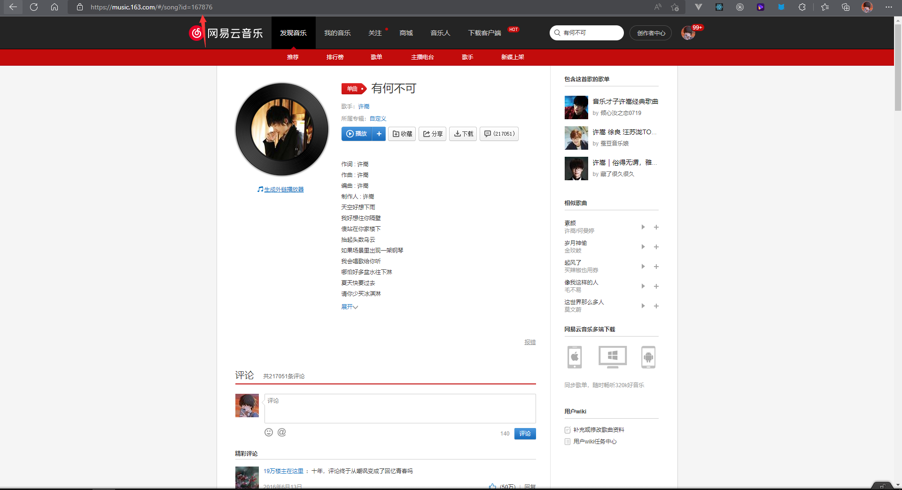

# 音乐组件

## 组件依赖

### 安装

```sh
npm i aplayer
```

## 组件源码

```vue
<script setup lang="ts">
import { defineProps, toRefs, onMounted, onUnmounted, shallowRef, watch } from "vue"
import APlayer from "aplayer"
import "aplayer/dist/APlayer.min.css"

const aplayer = shallowRef<HTMLElement>()

const props = defineProps<{
  id: string
}>()

const { id } = toRefs(props)
let instance: unknown = null

const init = () => {
  unMount()
  const theme = getComputedStyle(document.documentElement).getPropertyValue("--themeColor")
  //网易云模式
  const url = `https://api.i-meto.com/meting/api?server=netease&type=song&id=${
    id!.value
  }&r=${Math.random()}`
  fetch(url)
    .then(res => res.json())
    .then(data => {
      const song = data[0]
      instance = new APlayer({
        container: aplayer.value,
        theme: theme,
        loop: "loop",
        lrcType: 3,
        audio: [
          {
            name: song.title,
            artist: song.author,
            url: song.url,
            cover: song.pic,
            lrc: song.lrc,
          },
        ],
      })
    })
}
const unMount = () => {
  if (instance) {
    instance.destroy()
  }
}
watch(props, init)
onUnmounted(unMount)
onMounted(init)
</script>

<template>
  <div class="aplayer" ref="aplayer"></div>
</template>

<style lang="scss" scoped>
.aplayer {
  margin-bottom: 20px;
  white-space: normal !important;
}
.aplayer:deep(.aplayer-title) {
  color: #333;
}
</style>
```

## 使用

```html
<my-music id="1899705498"></my-music>
```

:::tip
此处的 id 为网易云音乐的歌曲 id,可前往网易云音乐 PC 官网歌曲页面 url 地址栏中获取到
:::


